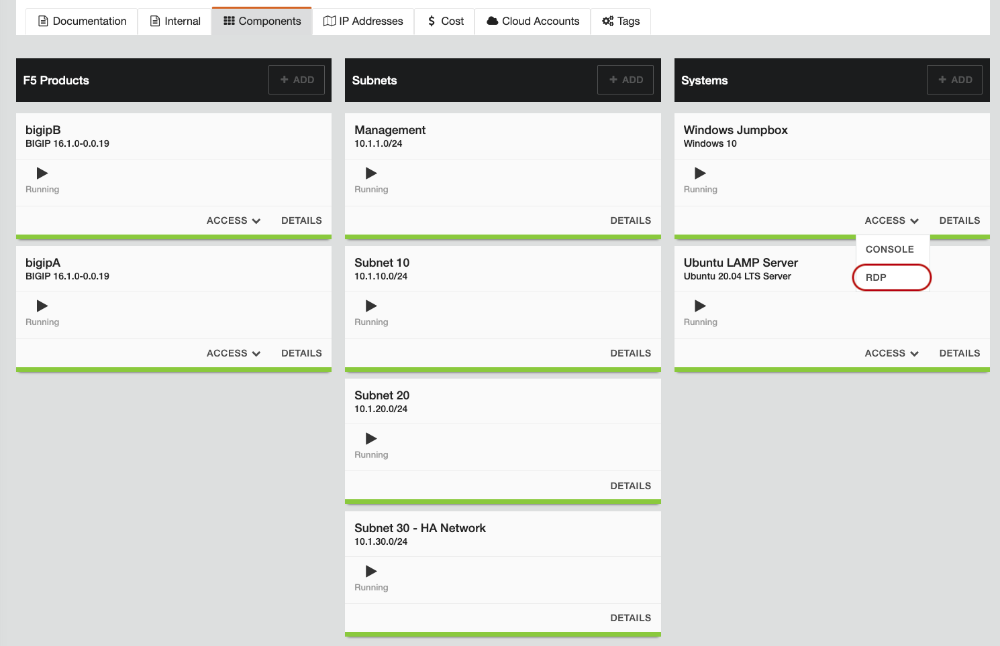
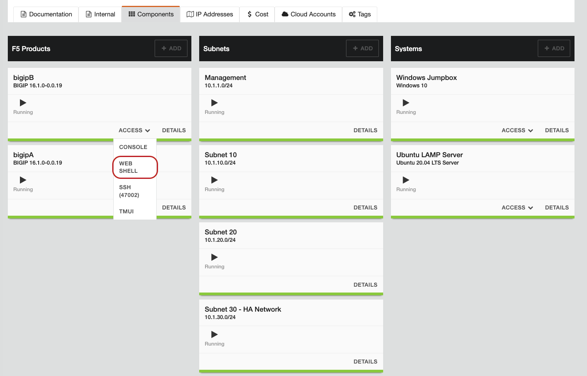
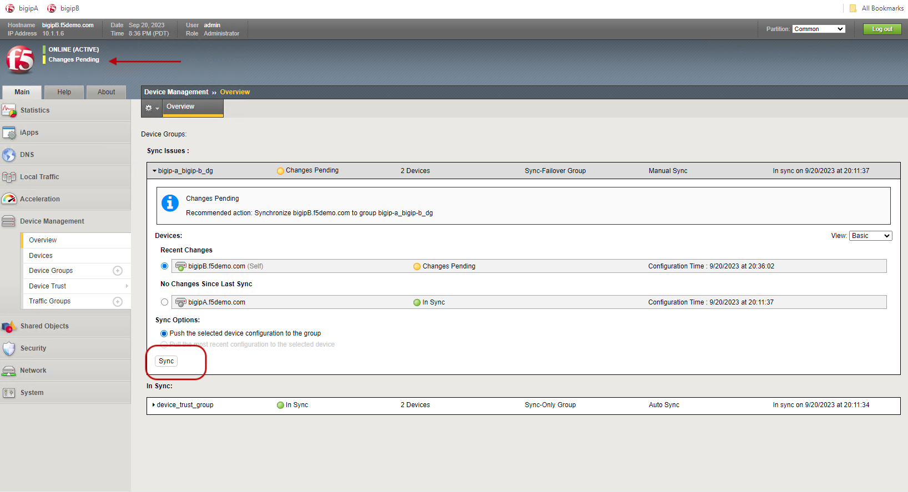

The following components have been included in your lab environment:

- F5 BIG-IP VE (bigipA)
- F5 BIG-IP VE (bigipB)
- Windows Jumphost
- Ubuntu LAMP Server

| Host | Management IP | username:password |
|----------|----------|----------|
| bigipA | 10.1.1.5 | admin:admin.F5demo.com and/or root:default |
| bigipB | 10.1.1.6 | admin:admin.F5demo.com and/or root:default|
| Windows Jumpbox | 10.1.1.7 | external_user:admin.F5demo.com |


- RDP into Windows Jump box using ```external_user:admin.F5demo.com```




- Now login into the BIG-IP using Access --> Web Shell on bigipA & bigipB
- Login to bigipA using ```admin:admin.F5demo.com and/or root:default```
- Login to bigipB using ```admin:admin.F5demo.com and/or root:default```



- If you see the BIG-IPs are not sync, then go to Device Overview 
- Do Manual Sync as shown below


