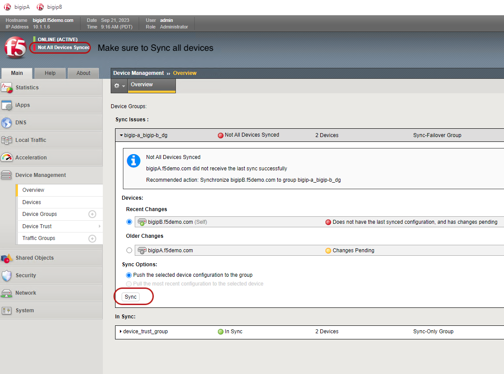
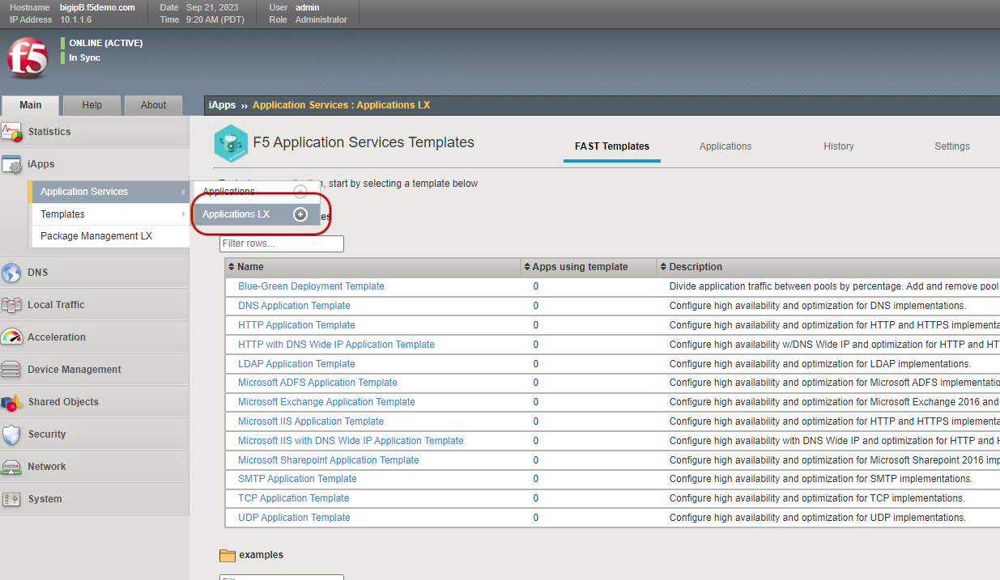
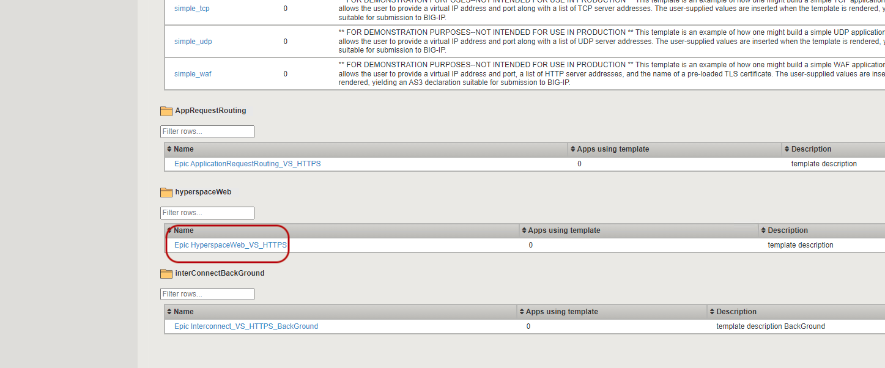
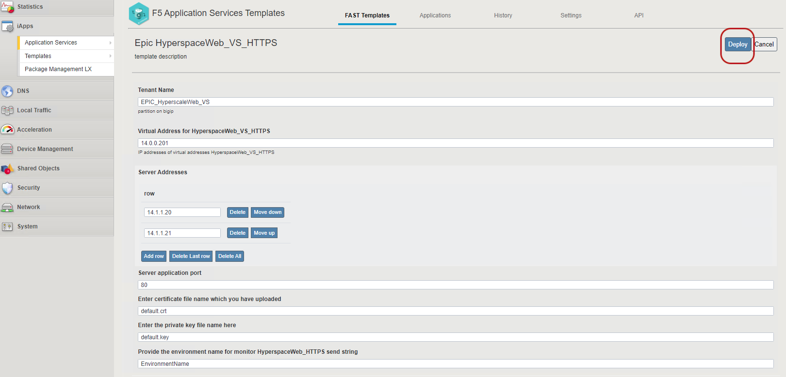
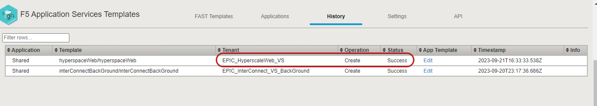
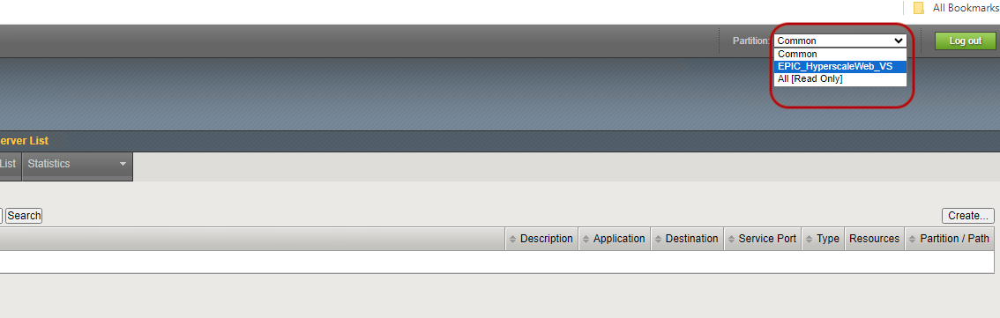
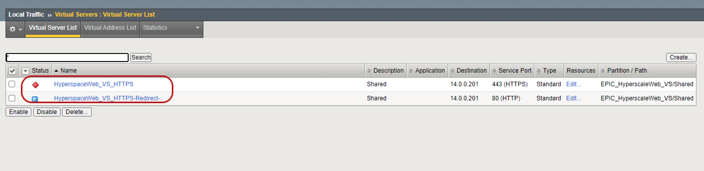

## Steps to Deploy HyperspaceWeb Application Objects

- login to BIG-IP ```https://10.1.1.6``` ```admin:admin.F5demo.com```
 
- Follow the below steps to deploy HyperspaceWeb objects on BIG-IP

- Make sure to Sync BIG-IP devices



- Navigate to Apps--> Application Services --> ApplicationLX 
- Then Select F5 Application Service Templates



- Go down on the page and locate HyperspaceWeb_VS_HTTPS template



- Click on the template and Hit Deploy



- You should see sucess in the History as shown below


- Navigate to Local Traffic tab on the left 
- Select Virtual server
- Select EpicHyperspace partition


- You should see the Virtual Server deployed



- Make sure you Sync the BIG-IP again navigating to Device Management
and Overview and click on Sync


[GoTo Next Exercise1.3](../Exercise1.3/README.md)

[GoBack](../README.md)
