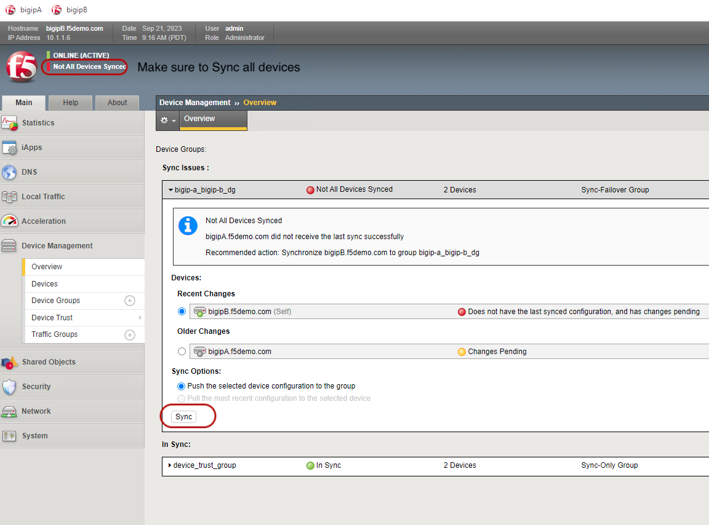
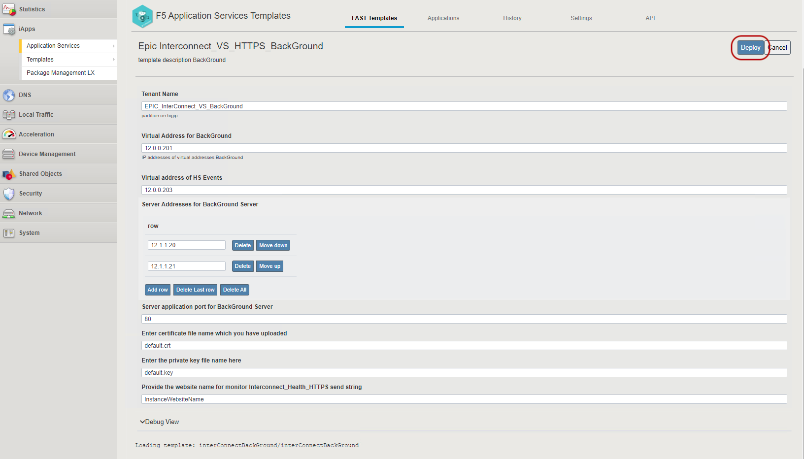

## Deploy First the App & then apply WAF policy

## Steps to Deploy InterConnect_Backgroud Application Objects

- login to BIG-IP ```https://10.1.1.6``` ```admin:admin.F5demo.com```
 
- Follow the below steps to deploy InterConnect_Backgroud onjects on BIG-IP

- Make sure to Sync BIG-IP devices



- Navigate to Application Services --> ApplicationLX 
- Then Select F5 Application Service Templates


- Go down on the page and locate InterConnect_Backgroud_VS_HTTPS template


- Click on the template and Hit Deploy



- You should see sucess in the History as shown below


- Select EpicHyperspace partition


- You should the see the Virtual Server deployed


- Make sure you Sync the BIG-IP again navigating to Device Management
and Overview and click on Sync


- Navigate to the virtual Server ```Epic_InterConnect_VS_Background```


- Navigate to the Security --> Policies 


- Enable WAF policy by enabling Application Security Policy


- You should see and shown in below screen shot


- Navigate to Application Security --> Security Policies --> Policies List
This will show you the Policy being applied to Virtual Server ```Interconnect_VS_HTTPS```


- You can also verify the policy on Standby BIG-IP
login to bigipB and check


[GoBack](../README.md)
