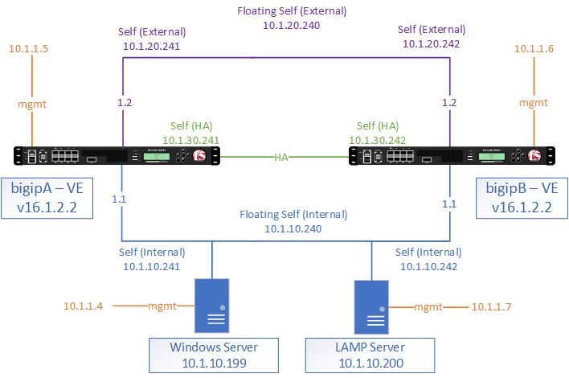

## Welcome to Epic FAST template deployment lab. 
This training will take you through the basic knowledge and exercises to gain understanding on how deploy F5 BIG-IP FAST templates for Epic applications

**Note:** 
If you have any questions or issues, [Click here to open an issue](https://github.com/scshitole/Fast_template.io/issues)

**Pre-requisites**

To get the most out of this training, the student should already have some basic knowledge about the use of FAST Templates on BIG-IP.

**Lab Environment**

The Lab has 2 BIG-IP in HA mode with all the templates installed already, you can try out deploying the applications objects using the templates.
We will use Unified Demo Framework (UDF) to run through the exercises in this workshop. 

## Architecture

The following topics will be covered

### Section 1 - Getting Started
- [Exercise 1.1 - Explore UDF environment](Exercise1.1)   
- [Exercise 1.2 - Deploy the HyperspaceWeb Application Objects](Exercise1.2)   
- [Exercise 1.3 - Deploy the InterConnect applications Objects](Exercise1.3)   

